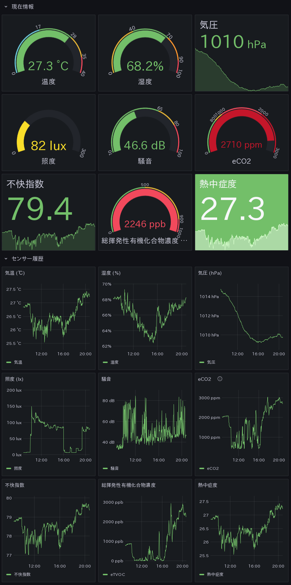

# OMRON 2JCIE-BU01 用 Prometheus exporter

- GitHub から取得

```
$ git clone https://github.com/ikoga/omron-sensor
```

- 下準備 (openSUSE Leap 15.6 の例)

```
# zypper in python3-prometheus_client
# mkdir /opt/omron-sensor
# cp omron-sensor/sensor.py /opt/omron-sensor
# cp omron-sensor/omron-sensor.service /etc/systemd/system/
# chown prometheus:prometheus /var/lib/prometheus/node-exporter
# systemctl enable --now omron-sensor.service
```

- `/etc/sysconfig/prometheus-node_exporter` にテキストインポートを追加して再起動

```
ARGS='--collector.textfile.directory=/var/lib/prometheus/node-exporter'

# systemctl restart prometheus-node_exporter.service
```


# 表示サンプル


